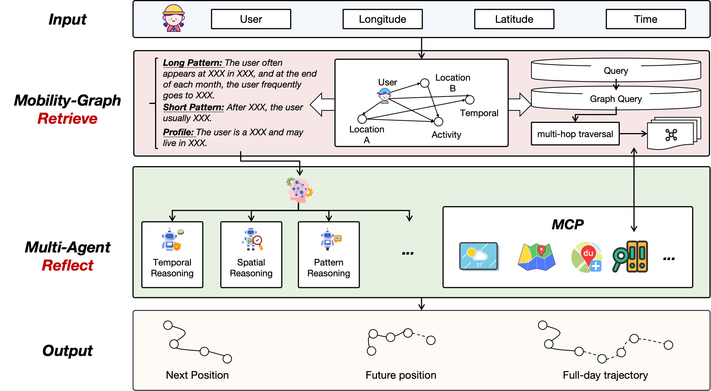

<div align="center">
  
  
  
  # 🗺️ MRRA
  **移动轨迹检索与反思智能体**
  
  *GraphRAG + 多智能体反思，赋能智能移动分析*
  
  [](https://badge.fury.io/py/mrra)
  [](https://www.python.org/downloads/)
  [](https://opensource.org/licenses/MIT)
  [](https://github.com/AoWangg/mrra/actions)
  
  [🚀 快速开始](#-快速开始) • [📖 文档](#-文档) • [🌟 特性](#-核心特性) • [🛠️ 安装](#️-安装)
  
</div>

---

## 🎯 项目概述

**MRRA**（移动轨迹检索与反思智能体）是一个前沿的Python包，通过融合 **GraphRAG**（基于图的检索增强生成）和 **多智能体反思** 技术，革命性地改变移动轨迹分析。只需提供包含 `user_id`、`timestamp`、`latitude`、`longitude` 列的轨迹数据，即可解锁下一位置、未来位置和完整日程路线的智能预测。

<div align="center">
  
</div>

## ✨ 核心特性

<table>
<tr>
<td>

### 🧠 **智能架构**
- **GraphRAG集成**: 先进的基于图的检索系统
- **多智能体反思**: 复杂的智能体协调与置信度加权
- **时空推理**: 深度理解移动模式

</td>
<td>

### 🔧 **开发友好**
- **即插即用**: 最小配置即可使用
- **LangChain兼容**: 与LangChain生态系统无缝集成
- **MCP工具**: 内置天气、地图和地理空间服务支持

</td>
</tr>
<tr>
<td>

### 📊 **数据处理**
- **灵活输入**: 支持标准轨迹格式
- **图构建**: 自动移动图生成
- **模式识别**: 智能活动和行为检测

</td>
<td>

### 🎯 **预测任务**
- **下一位置**: 预测即时下一个位置
- **未来位置**: 预测特定时间的位置
- **全天轨迹**: 生成完整的日常路线模式

</td>
</tr>
</table>

## 🛠️ 安装

### 快速安装
```bash
pip install mrra
```

### 开发安装
```bash
git clone https://github.com/AoWangg/mrra.git
cd mrra
pip install -e .
```

### 可选依赖
```bash
# MCP工具集成
pip install mrra[mcp]

# 开发环境
pip install mrra[dev]
```

## 🚀 快速开始

### 基本用法

```python
import pandas as pd
from mrra.data.trajectory import TrajectoryBatch
from mrra.retriever.graph_rag import GraphRAGGenerate
from mrra.agents.builder import build_mrra_agent

# 📊 准备轨迹数据
df = pd.DataFrame({
    'user_id': ['user_1', 'user_1', 'user_1'],
    'timestamp': ['2023-01-01 09:00:00', '2023-01-01 12:00:00', '2023-01-01 18:00:00'],
    'latitude': [31.2304, 31.2404, 31.2504],
    'longitude': [121.4737, 121.4837, 121.4937],
})

# 🔄 创建轨迹批次和检索器
tb = TrajectoryBatch(df)
retriever = GraphRAGGenerate(tb=tb)

# 🤖 构建MRRA智能体
agent = build_mrra_agent(
    llm={
        "provider": "openai-compatible",
        "model": "qwen-plus", 
        "base_url": "https://dashscope.aliyuncs.com/compatible-mode/v1",
        "api_key": "YOUR_API_KEY"  # 生产环境建议使用环境变量
    },
    retriever=retriever,
    reflection={
        "max_round": 3,
        "subAgents": [
            {"name": "temporal", "prompt": "时间推理专家", "mcp": {"weather": {}}},
            {"name": "spatial", "prompt": "空间分析专家", "mcp": {"maps": {}}},
            {"name": "pattern", "prompt": "行为模式分析师", "mcp": {}},
        ],
        "aggregator": "confidence_weighted_voting"
    }
)

# 🎯 进行预测
result = agent.invoke({
    "task": "next_position", 
    "user_id": "user_1", 
    "t": "2023-01-02 09:30:00"
})
print(result)
```

### 高级MCP集成

```python
# 🗺️ 配置真实世界服务
reflection_config = {
    "subAgents": [
        {
            "name": "spatial", 
            "prompt": "具备实时地图数据的空间分析专家", 
            "mcp": {
                "gmap": {
                    "url": "https://mcp.amap.com/sse?key=YOUR_AMAP_KEY", 
                    "transport": "sse"
                }
            }
        }
    ]
}
```

## 🎯 支持的任务

| 任务 | 描述 | 输入 | 输出 |
|------|------|------|------|
| `next_position` | 预测给定时间后的下一个位置 | `user_id`, `t` | 下一个坐标预测 |
| `future_position` | 预测特定未来时间的位置 | `user_id`, `t` | 未来坐标预测 |
| `full_day_traj` | 生成完整的日常轨迹 | `user_id`, `date` | 全天路线序列 |

## 📊 数据格式

### 必需列
- `user_id`: 每个用户的唯一标识符
- `timestamp`: ISO格式时间戳（如 "2023-01-01 09:00:00"）
- `latitude`: 纬度坐标（浮点数）
- `longitude`: 经度坐标（浮点数）

## 🌍 MCP工具集成

MRRA支持多种MCP集成策略，具有优雅的降级机制：

1. **主要**: `langchain-mcp-adapters`（推荐）
2. **降级**: `langchain-mcp` 工具包
3. **原生**: 原始MCP SSE发现

### 支持的服务
- 🗺️ **地图**: Google Maps、高德地图、OpenStreetMap
- 🌤️ **天气**: 实时天气数据
- 📍 **地理编码**: 地址到坐标转换

## 📖 文档

- 🏠 **主页**: [mrra.tech](https://www.mrra.tech/)
- 📚 **Documentation**: [mrra.tech/en/docs](https://mrra.tech/en/docs)
- 🇨🇳 **中文文档**: [mrra.tech/zh/docs](https://mrra.tech/zh/docs)

## 🧪 示例与演示

```bash
# 🌟 GeoLife数据集演示
python scripts/verify_geolife.py

# 🔍 检索器测试
python scripts/check_retriever.py
```

## 🤝 贡献

我们欢迎贡献！请查看我们的[贡献指南](CONTRIBUTING.md)了解详情。

### 开发环境设置
```bash
# 创建环境
conda create -n mrra-dev python=3.10
conda activate mrra-dev

# 开发模式安装
pip install -e .[dev]

# 运行测试
pytest

# 代码格式化
ruff format .
ruff check .
```

## 🔒 安全性与最佳实践

- 🔐 **永远不要提交API密钥** - 使用环境变量或密钥管理器
- 📁 **大型数据集** 默认被git忽略
- 🛡️ **安全MCP连接** 使用适当的身份验证

## 📄 许可证

本项目采用MIT许可证 - 详见[LICENSE](LICENSE)文件。

## 🙏 致谢

站在巨人的肩膀上：
- [LangChain](https://github.com/langchain-ai/langchain) 用于LLM编排
- [NetworkX](https://github.com/networkx/networkx) 用于图处理
- [Pandas](https://github.com/pandas-dev/pandas) 用于数据操作

## 📊 项目统计

<div align="center">


</div>

---

<div align="center">
  <sub>🚀 <strong>准备好革命性地改变移动分析吗？</strong> <a href="#-快速开始">立即开始！</a></sub>
</div>